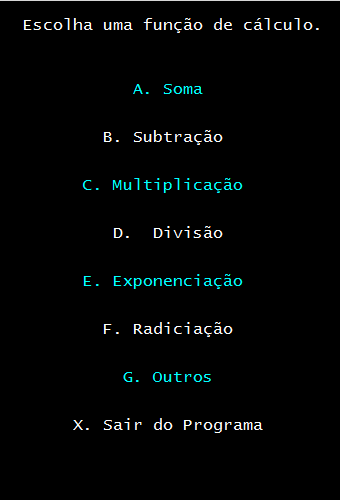

# ProjetoDeSoftware
Calculadora que além de executar funções básicas de forma simples, também soluciona teoremas variados.

## Menu
O menu interativo funciona de forma que o usuário escolhe a letra correspondente à necessidade momentânea.

## Instruções
### Soma, subtração, multiplicação e divisão
Os sistemas básicos de conta ocorrem de forma que o usuário insere uma determinada quantidade de valores numéricos e após pressionar o conjunto de teclas "= + enter" recebe o resultado de se cálculo.

### Exponenciação e Racionalização
Em relação às contas com potência e raiz, são necessários dois valores: na exponenciação os valores são o elemento que será elevado (base) e o expoente, que elevará esse número; já na racionalização, que também necessita de dois números, é perguntado o radicando, ou seja, o número dentro da raiz e o índice, que é o elemento que decidirá se será uma raiz quadrada, cúbica, ou outra.

### Outros
No programa também está inserido algumas possíveis formas de cálculo mais utilidades no meio acadêmico e no meio comercial, isto é, bhaskara, teorema de pitágoras e porcentagem de determinado número.

### Recomendação
O programa é inteiramente feito em linguagem C# para console, portanto algumas recomendações para uma melhor vizualização, em questão de estética é:

-Fonte em _Lucida Console_;

-Tamanho em 20;

-Tamanho do buffer de tela (largura: 80; altura: 300);

-Tamanho da janela (largura: 80; altura: 28);

-Posição da janela (esquerda: 26; superior: -1);

-Tela de fundo.

  
  

